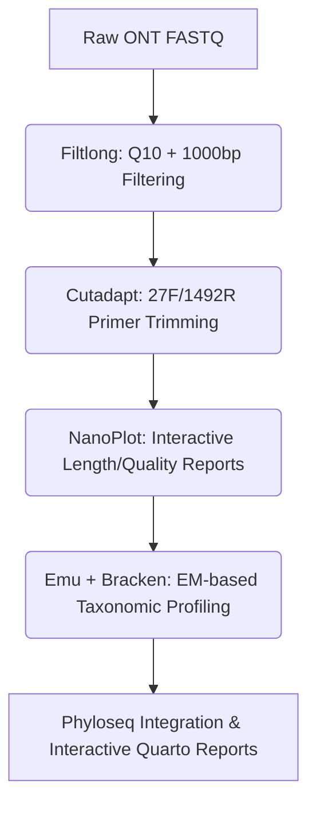

# 🧬 Hybrid 16S rRNA Amplicon Analysis Pipeline
### *A Hands-On Tutorial for V3-V4 Short-Read & Full-Length ONT Long-Read Analysis*

Welcome to the **Hybrid 16S rRNA Amplicon Analysis Pipeline**. This pipeline is a modular, high-performance workflow managed by **`pixi`** and orchestrated by a single central configuration panel. It seamlessly handles both:
1. **Short-Read V3-V4 Illumina Data:** Denoised via DADA2 into Exact Sequence Variants (ASVs).
2. **Full-Length ONT Long-Read Data:** Quality-filtered via `Filtlong`, verified via `NanoPlot`, and mapped via high-speed `minimap2` alignments.

Best of all, **100% of your downstream analytical code** (Phyloseq, repeated-measures mixed stats, co-occurrence networks, and PICRUSt2) works out-of-the-box in both modes!

---

## 🛠️ Tutorial 1: Central Configuration (`pipeline.config`)

We have decoupled the configurations from the pipeline scripts into a unified configuration file: **`pipeline.config`**. Sourced automatically by the orchestrator, this file serves as your central command deck.

### 📋 Key Configuration Parameters
Open [pipeline.config](file:///worker_data2/huyha/precisiongene/16S_thong/16S_shortread_analysis/pipeline.config) to adjust parameters:
- **`MODE`:** Set to `"shortread"` (Illumina V3-V4) or `"longread"` (Nanopore Full-length).
- **`THREADS`:** Specify thread limits (supports granular allocations per job, optimized for up to 64 cores / 256GB RAM).
- **Filtlong Filters:** Adjust `FILTLONG_MIN_LEN` (default 1000 bp) and `FILTLONG_MIN_Q` (default Q10) to control long-read filtration rigor.
- **Reference Database Path Overrides:** Sourced directly to bypass massive Zenodo downloads if you already have the SILVA reference files locally!

---

## 🚀 Tutorial 2: Short-Read (V3-V4) Analysis Walkthrough

### Step 1: Import Raw Sequencing Reads
Place your raw compressed paired-end Illumina FASTQ reads (e.g. `*_R1.fastq.gz` and `*_R2.fastq.gz`) inside the `data/` directory.

### Step 2: Generate Sample Sheets & Metadata
Scan your raw sequencing files and generate a paired sample sheet:
```bash
pixi run generate_samples
```
Then, generate cohort metadata detailing treatment groups, time-series days, and subject identifiers:
```bash
pixi run generate_metadata
```

### Step 3: Run the Orchestrated Workflow
Set `MODE="shortread"` in your [pipeline.config](file:///worker_data2/huyha/precisiongene/16S_thong/16S_shortread_analysis/pipeline.config) and launch:
```bash
pixi run all
```
This triggers:
1. **MD5 Data Integrity Check** (`check_md5.sh`).
2. **Quality Control & Standard Primer Trimming** (FastQC, Cutadapt, MultiQC).
3. **Reference Database Cache Verification** (Downloads Zenodo reference if missing).
4. **DADA2 Denoising & Taxonomy Assignment** (`02_dada2.R` using quality-asymmetric truncations `c(270, 210)`).
5. **Downstream Phyloseq Assembly, mixed-effects Stats, Networks, and PICRUSt2 predictions.**

---

## 🧬 Tutorial 3: Long-Read (Full-Length ONT) Analysis Walkthrough

When analyzing long reads, the biology and raw error rates differ. This pipeline integrates state-of-the-art tools specifically designed for single-molecule long amplicons.



### Step 1: Place Your Raw ONT FASTQ Files
Move your raw single-end Oxford Nanopore reads (gzipped) into the `data/` directory.

### Step 2: Configure to Long-Read Mode
Edit your [pipeline.config](file:///worker_data2/huyha/precisiongene/16S_thong/16S_shortread_analysis/pipeline.config) and update `MODE`:
```bash
export MODE="longread"
```

### Step 3: Generate the ONT Sample Sheet
Regenerate your `sample.tsv` mapping file:
```bash
pixi run generate_samples
```
*Note: For single-end ONT runs, `ForwardPath` will list your FASTQ files, and `ReversePath` will automatically be ignored.*

### Step 4: Execute Long-Read Preprocessing & Classification
Run the pipeline:
```bash
pixi run all
```
This automatically invokes the custom ONT stages:
1. **`Filtlong` Filtration:** Discards low-quality reads (mean quality < Q10) and short artifacts (< 1000 bp).
2. **`Cutadapt` Trimming:** Searches for standard universal primers (**27F** and **1492R**) in both forward and reverse orientations and clips them.
3. **`NanoPlot` Visual Reporting:** Generates interactive QC plots showing quality/length densities.
4. **`Emu` & `Bracken` Classification:** State-of-the-art Expectation-Maximization taxonomic mapping for highly accurate species-level resolution from Nanopore reads.

---

## 🛡️ Tutorial 4: Contaminant & rRNA Validation (Decontam & Barrnap)

This pipeline integrates robust quality-control layers for biological validation:

### 1. Barrnap (Short-Read rRNA Validation)
When running in `shortread` mode, DADA2 generates unknown de novo ASVs. The pipeline automatically invokes **Barrnap** to scan these ASV sequences and discard any non-16S artifacts (like host DNA or genomic junk) before downstream analysis. *(Note: This step is automatically skipped in Long-Read mode because Emu natively aligns exclusively to 16S databases).*

### 2. Decontam (Statistical Contaminant Removal)
Microbiome sequencing is sensitive to background laboratory contamination (the "kitome"). **Decontam** is a statistical tool that identifies contaminants by comparing the prevalence of bacteria in your real samples against your **Negative Controls (Blanks)**.

**To enable Decontam for your pipeline:**
1. Open your `metadata.tsv` file.
2. Add a new column named **`is_control`**.
3. Set the value to `TRUE` for your Blank/Negative Control samples, and `FALSE` for your real biological samples.

The pipeline will automatically detect this column and run Decontam. If you do not have negative controls, simply leave this column out and the pipeline will safely bypass the Decontam step.

---

## 💾 Tutorial 5: Bypassing Zenodo Database Downloads

The Zenodo reference files can be large and take time to download. If you already have them cached locally, you can **instantly bypass the download step**:

1. Open your [pipeline.config](file:///worker_data2/huyha/precisiongene/16S_thong/16S_shortread_analysis/pipeline.config) file.
2. Uncomment and define the absolute path to your local database files:
   ```bash
   export SILVA_TRAIN_FILE="/your/local/path/to/silva_nr99_v138.1_train_set.fa.gz"
   export SILVA_SPECIES_FILE="/your/local/path/to/silva_species_assignment_v138.1.fa.gz"
   ```
3. Run `pixi run all`. The orchestrator will verify these files exist and **automatically skip Stage 2 (Reference Downloader)**, saving you bandwidth and time.

---

## 📁 6. Directory & Outputs Architecture

Once execution succeeds, your outputs are dynamically organized within the `results/` folder:

```
results/
├── 00_qc/
│   ├── raw/                 # FastQC raw summaries
│   ├── trimmed/             # FastQC post-trimming summaries
│   ├── nanoplot_raw/        # NanoPlot interactive raw ONT reports
│   └── nanoplot_trimmed/    # NanoPlot interactive filtered ONT reports
├── 01_trimmed/              # Quality-trimmed, primer-free FASTQs
├── 02_dada2/                # Standard seqtab_nochim.rds / taxonomy.rds / asvs.fasta
├── 03_phyloseq/             # phyloseq_obj.rds and Excel taxa abundance spreadsheets
├── 04_stats/                # Linear mixed models (LMM) ANOVA and PCoA trajectory plots
├── 05_network/              # Comparative inter-species correlation networks per group
├── 06_picrust2/             # Metagenome pathway predictions (MetaCyc, KO, EC counts)
└── multiqc_report.html      # Cohesive quality reporting dashboard
```

---

## ⚠️ 7. Troubleshooting: "FILE NOT FOUND" Errors

If you run the pipeline and see massive streams of `❌ data/sample_R1.fq.gz : FILE NOT FOUND!` failures:

### Why this happens
Your current `sample.tsv` points to sequencing paths (e.g. `data/0-12_merged_L00_R1.fq.gz`) that do not exist in your active `data/` directory.

### The Fix
1. Move your actual raw FASTQ files into the `data/` directory.
2. Regenerate your clean, active sample sheet:
   ```bash
   pixi run generate_samples
   ```
3. Run the pipeline again. The integrity checker will now pass and execute perfectly!

---
*Created by Antigravity Bioinformatics Suite — High-Performance Ecological Analytics.*
