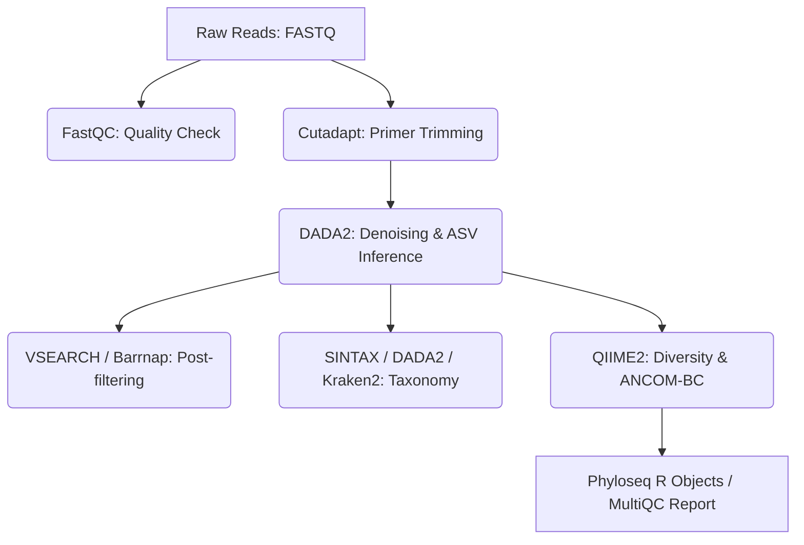

# 🧬 Modern Longitudinal 16S Microbial Analysis Pipeline

Welcome to the **Modern 16S rRNA Microbial Analysis Pipeline**. This workflow is specifically designed for analyzing **paired-end 300 bp (PE300) V3-V4 amplicon sequencing data** with a complex **longitudinal experimental design** (e.g., 3 Groups compared across 3 Days of collection with repeated measures).

Powered by **`pixi`**—a state-of-the-art, Rust-based package and environment manager—this pipeline delivers rapid environment setups, absolute reproducibility, and lightweight script-based execution. Crucially, it incorporates advanced statistical and ecological features **completely missing or limited in standard pipelines like `nf-core/ampliseq`**.

---

## 📋 1. Core Principles & Requirements of `nf-core/ampliseq` (v2.17.0)

To establish our baseline, we first extract the principles, tools, and requirements of the standard `nf-core/ampliseq 2.17.0` pipeline.

### Core Principles
`nf-core/ampliseq` is an asset-heavy Nextflow pipeline designed to process amplicon sequencing data from raw FASTQ reads to basic downstream statistics. Its core principles are:
*   **Containerized Reproducibility:** Relying on Nextflow and Docker/Singularity/Podman to isolate execution environments.
*   **Amplicon Sequence Variant (ASV) Superiority:** Using denoising (DADA2) instead of OTU clustering (97%) to achieve single-nucleotide resolution.
*   **Taxonomic Robustness:** Support for multiple classifiers (DADA2 Naive Bayes, SINTAX, Kraken2, QIIME2) to construct consensus-driven taxonomy.
*   **General Downstream Analytics:** Standard alpha/beta diversity, rarefaction, and differential abundance via QIIME2 ANCOM-BC.

### Standard Pipeline Flow & Tools


### Analysis Requirements of `ampliseq`
1.  **System Requirements:** Nextflow, Docker/Singularity engine, large storage for database caching, and high-performance computing (HPC) setups.
2.  **Input Data Requirements:** Raw paired-end or single-end FASTQ files, a metadata sheet in TSV/CSV format, and specified forward/reverse primer sequences.
3.  **Limitations:** Standard `ampliseq` excels at **static** comparisons (Group A vs Group B) but **completely lacks specialized tools for longitudinal, time-series, or repeated-measures experimental designs**.

---

## 🛠️ 2. The Custom `pixi`-based 16S Workflow with Longitudinal Innovations

We built a custom, modular, and extremely fast workflow managed by `pixi`. It consists of eight core scripts placed in the `script/` directory.

### Workflow Scripts Architecture
1.  **`script/check_md5.sh` (Raw sequencing MD5 verification)**
    *   **Tools:** `md5sum` (system-native checks), `gzip` integrity checker.
    *   **Validation Rigor:** Loops through all raw fastq files, verifies their hashes against `.md5` signature files, and features an automatic gzip structural integrity validation fallback if hash lists are absent.
2.  **`script/01_qc_trim.sh` (Quality Control & Primer Trimming)**
    *   **Tools:** `FastQC`, `Cutadapt`, `MultiQC`.
    *   **V3-V4 Optimization:** Trims default standard primers (**341F** and **805R**). It utilizes `Cutadapt --discard-untrimmed` to ensure that only reads with high-quality primer zones are carried forward. It also drops reads shorter than 200 bp to prevent short, non-overlapping sequences from contaminating denoising.
3.  **`script/download_db.sh` (Reference Database Downloader)**
    *   **Tools:** `wget` / `curl` with resume capabilities.
    *   **Robust Database Retrieval:** Downloads the large reference database files required for taxonomic assignment (**SILVA nr99 v138.1 training set** and **species assignment database**) and places them directly into `data/db/`.
4.  **`script/02_dada2.R` (ASV Inference & Taxonomic Assignment)**
    *   **Tools:** `dada2` (Bioconductor), `ggplot2`.
    *   **V3-V4 300 PE Optimization:** Standard 300 bp paired-end Illumina reads (e.g., MiSeq) suffer from severe quality decay at the end of the reverse read ($R_2$). 
        *   *Standard pipelines* apply strict, identical quality thresholds, filtering out massive amounts of reads or failing to merge.
        *   *Our script* implements **quality-optimized asymmetric truncation**: **`truncLen = c(270, 210)`** and **`maxEE = c(2, 5)`** (relaxed expected error for $R_2$). This ensures that we drop the tail-end errors of the reverse reads while maintaining a combined length of $480$ bp, which leaves a robust $\sim 60$ bp overlap (minimum required is 20 bp) for 100% accurate merging.
        *   *Fast Database Verification:* Confirms that the SILVA databases are successfully cached in `data/db/` before executing to guarantee zero runtime failures.
5.  **`script/03_phyloseq_prep.R` (Phyloseq Assembly & Data Export)**
    *   **Tools:** `phyloseq` (Bioconductor), `tidyverse`, `openxlsx`.
    *   **Direct TSV Metadata Parsing:** Loads and strictly validates the standardized tab-separated values cohort sheet **`data/metadata.tsv`**. It checks that required longitudinal columns (`SampleID`, `Group`, `Day`, and `SubjectID`) are fully populated and aligned with sequencing data, providing descriptive error warnings if missed.
    *   **Abundance Sheet Exports:** Aggregates abundances at all ranks (ASV down to Phylum) and exports them into TSVs and a single multi-sheet Excel workbook (`taxa_abundance_tables.xlsx`). It also exports a formatted pure ASV table (`asv_table_picrust.tsv`) for PICRUSt2.
6.  **`script/04_longitudinal_stats.R` (Advanced Repeated-Measures Statistics)**
    *   **Tools:** `lme4`, `lmerTest`, `vegan`, `ggpubr`, `cowplot`.
    *   *This is a massive analytical upgrade over standard pipelines.* It addresses the repeated collection of samples from subjects across 3 days using advanced mixed modeling.
7.  **`script/05_network_analysis.R` (Comparative Co-occurrence Networks)**
    *   **Tools:** `igraph`, `tidyverse`, `cowplot`.
    *   Constructs and calculates ecological interaction networks independently for each of the 3 groups to examine how experimental treatments affect microbial social structures over time.
8.  **`script/06_picrust2.sh` (Predictive Metagenome Functional Analysis)**
    *   **Tools:** `PICRUSt2` (Python-based command line suite).
    *   Aligns your ASVs to a high-density reference database to predict the metagenomic pathway abundances (MetaCyc), KEGG Orthologies (KO), and Enzyme Commission (EC) numbers present in your sample community.

---

## 🚀 3. Key Innovations & Up-to-Date Features Beyond `ampliseq`

Standard pipelines (including `nf-core/ampliseq 2.17.0`) evaluate samples as static, independent entities. For longitudinal studies, this violates basic statistical assumptions (correlation within the same subject). Our pipeline implements four major innovations:

### Innovation A: Longitudinal Alpha Diversity LMM (Linear Mixed-Effects Models)
Standard tools run simple pairwise t-tests or ANOVA, which ignore repeated measures. We fit a linear mixed model for Alpha index (Shannon, Observed):
$$\text{Alpha Metric} \sim \text{Group} \times \text{Day} + (1 \mid \text{SubjectID})$$
*   **Fixed Effects:** `Group` (treatment effect), `Day` (temporal effect), and `Group:Day` (does the treatment effect change over time?).
*   **Random Effect:** $(1 \mid \text{SubjectID})$ accounts for the baseline variation of each subject.
*   **Output:** Generates full Type-III ANOVA tables (Satterthwaite approximation) and visual spaghetti trajectory charts tracking individual subjects over the 3 days.

### Innovation B: Stratified Permutations for Beta Diversity (Longitudinal PERMANOVA)
When calculating beta diversity differences via PERMANOVA (`adonis2`), standard workflows scramble all samples across the entire dataset. For longitudinal designs, this violates temporal correlation, yielding false-positive p-values.
*   **Our Solution:** We implement **Stratified PERMANOVA**:
    `adonis2(dist_matrix ~ Group * Day, data = metadata, strata = metadata$SubjectID)`
*   This restricts permutations **strictly within each subject**, ensuring that temporal changes are tested against correct ecological baselines. The script also plots PCoA ordination with **vector trajectories** showing how the community structure moves across the 3 days for each group.

### Innovation C: Compositional Mixed-Effects Differential Abundance (CLR-LMM)
Microbiome count data is compositional (constrained by the total capacity of the sequencer).
*   **Standard Method:** ANCOM-BC or DESeq2, which do not correctly support longitudinal random effects without complex manual R setups.
*   **Our Solution:** We perform a **Centered Log-Ratio (CLR)** transformation on genus-level abundances, which moves the data from compositional counts to an open, Euclidean space.
*   We then fit a Linear Mixed Model on the CLR-abundance of each genus:
    $$\text{CLR Abundance} \sim \text{Group} \times \text{Day} + (1 \mid \text{SubjectID})$$
*   We extract p-values for all terms and apply **Benjamini-Hochberg (FDR) corrections**. This locates specific biomarker genera that are:
    1. Differentially abundant between groups.
    2. Changing dynamically over the 3 days.
    3. Responding differently over time based on their group (significant Interaction).

### Innovation D: Comparative Ecological Network Analysis
Inter-species interactions represent a major dimension of microbial ecology. Standard pipelines provide no co-occurrence networks.
*   **Our Solution:** We construct co-occurrence networks for **each of the 3 groups** using Spearman correlation (robust to sparse distributions) with Benjamini-Hochberg FDR adjustments ($q < 0.05$) and strong link filtering ($|r| \ge 0.6$).
*   The script calculates and compares global network topological properties:
    *   **Nodes & Edges Count:** Sizes of the networks.
    *   **Network Density:** Ratio of observed vs. potential connections.
    *   **Average Degree:** Mean number of partners per microbe.
    *   **Clustering Coefficient:** Transitivity (tendency to form tightly-knit ecological cliques).
*   Outputs beautiful, side-by-side network charts (colored by Phylum, edge thickness by correlation strength, green = positive, red = competitive/negative relationships).

---

## 📊 4. Detailed Comparative Summary: Our Workflow vs. `nf-core/ampliseq`

The matrix below compares `nf-core/ampliseq 2.17.0` and our custom **Pixi-Longitudinal** workflow across critical technical and biological benchmarks.

| Feature / Dimension | `nf-core/ampliseq 2.17.0` | Our `pixi` Longitudinal Pipeline |
| :--- | :--- | :--- |
| **Package / Env Manager** | Nextflow + Conda / Docker / Singularity | **`pixi`** (Rust-powered, ultra-fast solver + strict `pixi.lock` reproducibility) |
| **Computational Footprint** | Extremely heavy. Requires Nextflow engine, Docker daemon, massive cache space. | **Lightweight & Native.** Single-command setup, no virtual engines, runs instantly on any server. |
| **V3-V4 300 PE Optimization** | Basic. Standard symmetrical truncation which often destroys merge rates for lower-quality R2 reads. | **Advanced Asymmetric Truncation** (`truncLen=c(270, 210)`, `maxEE=c(2,5)`) designed to rescue PE300 reverse reads. |
| **Repeated-Measures Alpha Stats** | 🚫 None. Performs basic static pairwise Wilcoxon/Kruskal-Wallis tests only. | **Linear Mixed-Effects Models (LMM)** via `lme4`/`lmerTest`. Correctly handles repeated measures (`(1\|SubjectID)`). |
| **Repeated-Measures Beta Stats** | 🚫 None. Standard non-stratified PERMANOVA (violates temporal dependence assumptions). | **Stratified PERMANOVA** (`strata = SubjectID` in `adonis2`), restricting permutations within subjects. |
| **Time-Series Volatility Plots** | 🚫 None. | **Automated Volatility Tracking** for both Alpha Diversity and top Phyla/Genera across the 3 days. |
| **Longitudinal Biomarker Discovery** | Limited. ANCOM-BC or DESeq2 cannot easily model Subject random effects. | **CLR-LMM Compositional Analysis**. Centered Log-Ratio transform coupled with LMMs and FDR adjustments. |
| **Microbial Co-occurrence Networks** | 🚫 Completely absent. | **Comparative `igraph` Network Module**. Computes Spearman network topology metrics and plots side-by-side. |
| **Result Accessibility** | Standard TSV files and standalone interactive HTML files (QIIME2 artifacts). | **High-utility exports**. Unified multi-sheet Excel workbooks (`taxa_abundance_tables.xlsx`), vector figures. |

### Pros & Cons Matrix
#### 1. Our `pixi` Longitudinal Workflow
*   **PROS:**
    *   **Targeted Statistical Rigor:** Statistically robust for repeated-measures/longitudinal study designs.
    *   **Rescues PE300 Data:** Tailored denoising thresholds maximize merging efficiency.
    *   **Stunning Ecological Depth:** Includes network ecology comparisons missing in major pipelines.
    *   **Unrivaled Speed:** `pixi` sets up the complete, complex environment in under a minute.
    *   **Zero Infrastructure Bloat:** No need to configure docker daemons, java nextflow scripts, or massive container downloads.
*   **CONS:**
    *   Runs on a single machine (though highly multi-threaded) compared to Nextflow which can distribute jobs across massive cloud clusters (AWS Batch, SLURM).
    *   Does not support direct PacBio long-read amplicon sequences out-of-the-box (easily added if needed, but this script is optimized for V3-V4).

#### 2. `nf-core/ampliseq` (2.17.0)
*   **PROS:**
    *   Highly scalable for massive cohort studies running on HPC grids.
    *   Excellent documentation and broad community backing.
    *   Integrated support for ITS region extraction (ITSx) and multiple non-standard primers.
*   **CONS:**
    *   Heavy overhead: requires downloading gigabytes of container images.
    *   **Useless for repeated measures:** Will calculate mathematically incorrect p-values for longitudinal studies because it treats repeated time points from the same subject as independent samples.
    *   No networks, no customized LMM modeling, no volatility tracking.

---

## 🏃 5. How to Run the Pipeline

Executing this pipeline is fully automated, driven by a standardized sample sheet (`data/sample.tsv`), centralized via the `master.sh` orchestrator, and unified through the `pixi` task runner.

### Step A: Configure Pipeline Settings & Dynamic Metadata
1.  **Configure `master.sh`:** Open the central orchestration file `master.sh` at the project root to adjust global parameters:
    *   Set thread limits (`THREADS`), primer sequences (`PRIMER_F`/`PRIMER_R`), or custom DADA2 parameters (`TRUNC_LEN_F` / `TRUNC_LEN_R`).
2.  **Move Raw FASTQ Reads:** Place your raw compressed paired-end fastq files inside the `data/` directory.
3.  **Generate Sample Sheet (`data/sample.tsv`):** Automatically scan the raw read files and generate the paired sample sheet containing the clean `SampleID` (split on the first `_` delimiter) and specific fastq paths:
    ```bash
    pixi run generate_samples
    ```
4.  **Generate Cohort Metadata (`data/metadata.tsv`):** Infer longitudinal groupings (`Group1`/`2`/`3`), sampling day (`Day1`/`2`/`3`), and repeated subjects directly from the active sample list:
    ```bash
    pixi run generate_metadata
    ```
    *Note: If you run `pixi run all`, the pipeline will automatically check for and generate both `sample.tsv` and `metadata.tsv` dynamically if they do not already exist!*

### Step B: Execution Commands
All commands run inside the isolated `pixi` environment and automatically inherit configurations from `master.sh`.

*   **To run the entire pipeline from raw reads to PICRUSt2 functional predictions:**
    ```bash
    pixi run all
    ```
    *(This triggers the master orchestrator `bash master.sh` to run all 7 stages sequentially with console logging.)*

*   **To run specific stages of the pipeline individually:**
    1.  *Quality Control & Primer Trimming (FastQC, Cutadapt, MultiQC):*
        ```bash
        pixi run qc_trim
        ```
    2.  *Reference Database Download (SILVA v138.1 training set & species assignment):*
        ```bash
        pixi run download_db
        ```
    3.  *DADA2 Denoising & SILVA Taxonomy Assignment:*
        ```bash
        pixi run dada2
        ```
    4.  *Phyloseq compilation & Excel abundance export:*
        ```bash
        pixi run phyloseq
        ```
    5.  *Longitudinal Mixed Models (Alpha, Beta trajectories, CLR-LMM biomarkers):*
        ```bash
        pixi run stats
        ```
    6.  *Group Network Comparison Analysis:*
        ```bash
        pixi run network
        ```
    7.  *PICRUSt2 Predictive Metagenome Functionality:*
        ```bash
        pixi run picrust2
        ```

### Pipeline Outputs Structure
Once completed, the pipeline populates the `results/` folder with organized, publication-ready results:
*   `results/multiqc_report.html`: Quality inspection before and after primer trimming.
*   `results/01_trimmed/`: Cleaned fastq files with V3-V4 primers removed.
*   `results/02_dada2/`: Quality curves, error rate learning plots, ASV fasta list, and R raw data (clean identifiers).
*   `results/03_phyloseq/`: Integrated `phyloseq_obj.rds`, `taxa_abundance_tables.xlsx` Excel workbook, and `asv_table_picrust.tsv`.
*   `results/04_stats/`:
    *   `alpha/`: Subject line trajectories, group boxplots, LMM ANOVA tables, and **`rarefaction_curve.png` (rarefaction curves)**.
    *   `beta/`: PCoA plots with directional subject trajectory lines, and stratified PERMANOVA reports.
    *   `differential/`: CLR-LMM taxonomic biomarkers sheet and top biomarker genus boxplot.
    *   `taxa_volatility_phylum.png`: Time-series phylum bar volatility chart.
    *   **`taxa_barplot_genus.png`**: Stacked Genus relative abundance volatility barplots.
*   `results/05_network/`: Co-occurrence networks (`network_groupa.png`, etc.) and topological comparison charts.
*   `results/06_picrust2/`:
    *   `pathways_out/path_abun_unstrat.tsv`: Unstratified predicted MetaCyc pathway relative abundances.
    *   `ko_metagenome_out/pred_metagenome_unstrat.tsv`: Predicted KEGG Orthology (KO) counts.
    *   `ec_metagenome_out/pred_metagenome_unstrat.tsv`: Predicted Enzyme Commission (EC) number counts.

---
*Created by Antigravity Bioinformatics Suite - Designed for Precision Genetics.*
